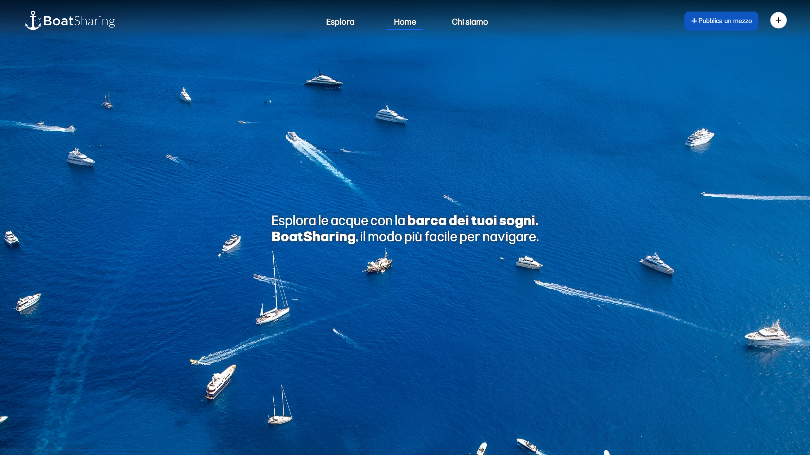
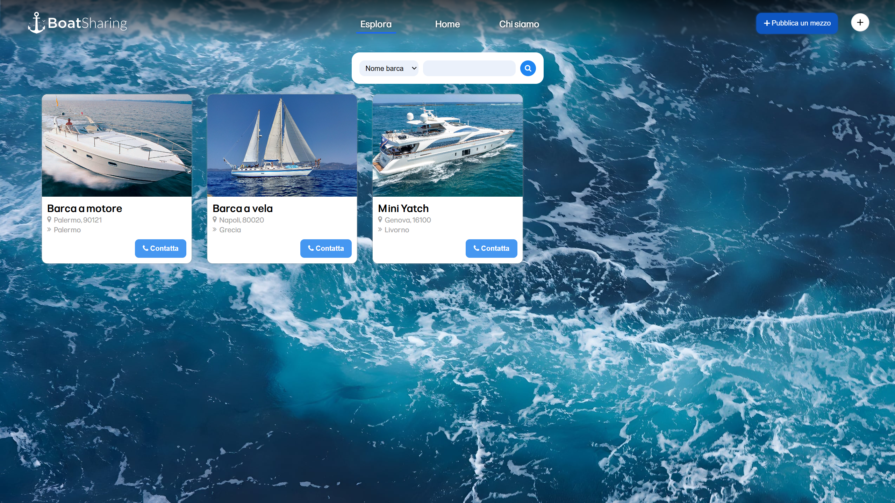
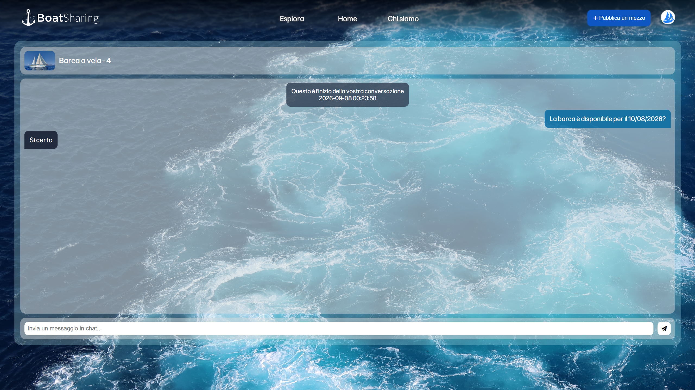
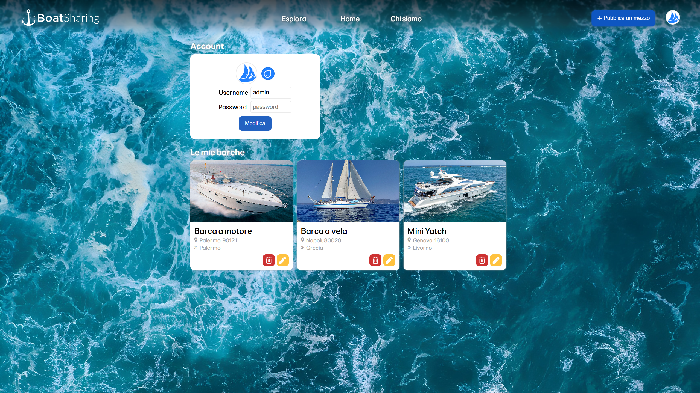

# ⛵ BoatSharing

**BoatSharing** è una piattaforma web completa pensata per estendere il concetto di Car Sharing al settore nautico. 

Il sito è stato sviluppato per essere fin da subito operativo e pronto all'utilizzo finale.

## Funzionalità Principali

- **Autenticazione & Account:** Sistema di registrazione, login e gestione profilo utente.
- **Messaggistica On-Site:** Sistema di chat integrato per la comunicazione tra utenti.
- **Database Relazionale:** Archiviazione dati gestita tramite **MariaDB** (gestione utenti, imbarcazioni e cronologia chat).
- **Configurazione Centralizzata:** Gestione parametri di sistema tramite file dedicato (`config.ini`).

## Configurazione (`config.ini`)

Il file di configurazione è suddiviso nelle seguenti sezioni:

### `DB`
| Nome | Tipo | Descrizione | Esempio |
| :--- | :--- | :--- | :--- |
| `servername` | `string` | Indirizzo del server MySQL/MariaDB | `localhost` |
| `dbname` | `string` | Nome del database | `boatsharing` |
| `username` | `string` | Username per l'accesso al DB | `root` |
| `password` | `string?` | Password per l'accesso al DB | `1234` |
| `maximagesize` | `int` | Dimensione massima immagini (byte) | `20971520` |

### `Paths`
| Nome | Tipo | Descrizione | Esempio |
| :--- | :--- | :--- | :--- |
| `boatimgs` | `string` | Cartella di destinazione immagini | `assets/images/boats` |

### `Support`
| Nome | Tipo | Descrizione | Esempio |
| :--- | :--- | :--- | :--- |
| `email` | `string` | Email di supporto mostrata in `about.php` | `supporto@example.com` |

## Anteprima

|||
|:---:|:---:|
| **Home Page** | **Catalogo** |

|||
|:---:|:---:|
| **Chat** | **Area Riservata** |